<center>

<br>
<font size="5">МИНОБРНАУКИ РОССИИ</font><br><br>
<font size="4">Федеральное государственное бюджетное</font>
<font size="4">образовательное учреждение высшего образования</font><br>
<font size="5">**«МИРЭА – РОССИЙСКИЙ ТЕХНОЛОГИЧЕСКИЙ УНИВЕРСИТЕТ»**</font><br><br>
<font size="4">Лабораторная работа по дисциплине:</font><br>
<font size="4">«Программные средства оперативно-аналитического поиска»</font><br><br>
<font size="4">Тема: Сбор информации о компаниях</font><br><br><br><br><br><br><br>
<div style="text-align: right"><font size="4">Выполнил:</font></div>
<div style="text-align: right"><font size="4">Студент 4 курса</font></div>
<div style="text-align: right"><font size="4">Специальности 10.05.05</font></div>
<div style="text-align: right"><font size="4">Группа ББСО-02-16</font></div>
<div style="text-align: right"><font size="4">Кузнецов Е.А.</font></div>
<div style="text-align: right"><font size="4">Проверил:</font></div>
<div style="text-align: right"><font size="4">Захарчук И.И.</font></div><br><br><br><br><br><br><br>
<font size="4">Москва, 2020</font><br><br><br>

<div style="text-align: left">
<font size="5">**Цель работы:**<br>
Собрать информацию о компаниях из списка S&P 500.<br><br>

**Исходные данные:**<br>

1) OS Windows;

2) OS Linux;

3) [Kraft Heinz Company](https://www.kraftheinzcompany.com) - Американский продовольственный концерн, возникший после слияния компаний Kraft Foods Inc. и H.J. Heinz Company. Является третьим по величине среди компаний по производству пищевых продуктов и напитков в Северной Америке и пятым в этом сегменте во всем мире;

4) [Kimberly-Clark Corporation](https://www.kimberly-clark.com/en) - Американская корпорация, один из лидеров по выпуску продукции для здравоохранения, личной, профессиональной и промышленной гигиены;

5) [State Street Corporation](https://www.statestreet.com/home.html) - Американская холдинговая компания, осуществляющая депозитарную и инвестиционную деятельность. Второй старейший из ныне действующих банков США;

6) [PVH.com](https://www.pvh.com) - Ранее известная как Phillips-Van Heusen Corporation, является американской компанией по производству одежды;

7) [HP Inc.](https://www8.hp.com/us/en/home.html) - Американская IT-компания, образовавшаяся в 2015 году вместе с Hewlett Packard Enterprise в результате разделения Hewlett-Packard, унаследовала производство персональных компьютеров и принтеров;

8) [2ip.ru](2ip.ru) - Портал сетевых сервисов;

9) [REG.ru](https://www.reg.ru) - Регистратор доменных имён;

10) [Linkonavt.ru](https://linkonavt.ru/services/sitetechnologies) - Сервис для самостоятельного продвижения сайтов;

11) **Nmap** - Свободная утилита, предназначенная для разнообразного настраиваемого сканирования IP-сетей с любым количеством объектов, определения состояния объектов сканируемой сети (портов и соответствующих им служб).<br><br>


**План выполнения работы:**<br>

1) С помощью сервиса [2ip.ru](2ip.ru) определим следующие признаки:<br>

<div style="margin-left:40px">

* IP-адрес;

* Местонахождение;

* Телефонные номера;

* E-mail;

</div>

2) Далее просканируем порты, используя операционную систему Linux, выполнив такую команду:<br>

<div style="margin-left:40px">
```{}
nmap <домен_компании>/<ip_адрес>
```
</div>

3) Далле при помощи сервиса [REG.ru](https://www.reg.ru) определим кто занимается хостингом данной компании, также для этого используем домен компании;

4) Далее используем данный сервис [Linkonavt.ru](https://linkonavt.ru/services/sitetechnologies). Определяем WEB-приложения по заданному домену;

5) И в итоге собираем всю найденную информацию о компании в таблицу.

</div>

<br><br>
<center>**Kraft Heinz Company**</center>
</font>
<br>

 **№** |   **Признак**   |     **Значение**
-------|-----------------|-----------------------
 **1** |      Сайт       | [kraftheinzcompany.com](https://www.kraftheinzcompany.com) 
 **2** |    IP-адрес     | *35.156.38.229* <br> **Germany**
 **3** | Местонахождение | EQ Shareowner Services<br>1110 Centre Pointe Curve, Suite 101<br>MAC N9173-010<br>Mendota Heights,<br>MN 55120
 **4** |    Телефон      | *1-855-598-5493* (in the U.S.)
 **5** |     E-mail      | **Registrant Email:** domainnames@kraftheinzcompany.com<br>**Admin Email:** domainnames@kraftheinzcompany.com<br> **Tech Email:** dns-admin@cscglobal.com
 **6** |     Порты       | 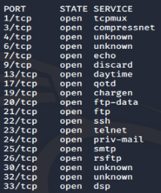
 **7** |     Хостинг     | 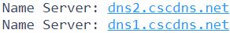<br>На основе DNS-серверов можем сделать вывод, что хостинг-провайдер [CSC Corporate Domains, Inc.](https://www.cscglobal.com/cscglobal/home/)
 **8** |  Web-технологии | 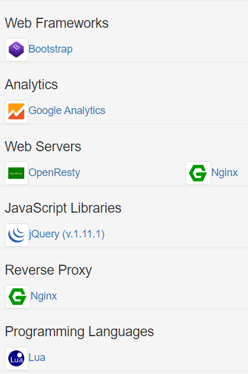
 
<br><br>
<font size="5">
<center>**Kimberly-Clark Corporation**</center>
</font>
<br>

 **№** |   **Признак**   |     **Значение**
-------|-----------------|-----------------------
 **1** |      Сайт       | [kimberly-clark.com](https://www.kimberly-clark.com) 
 **2** |    IP-адрес     | *205.203.71.250* <br> **United States**
 **3** | Местонахождение | Irving, Texas
 **4** |    Телефон      | **Tech Phone:** +1.3109741707<br>**Admin Phone:** +1.9207212000<br>**Admin Fax:** +1.9207214808 
 **5** |     E-mail      | **Tech Email:** hostmaster@kcc.com<br>**Admin Email:** hostmaster@kcc.com<br>**Registrant Email:** hostmaster@kcc.com
 **6** |     Порты       | 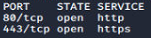
 **7** |     Хостинг     | 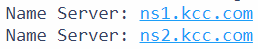<br>На основе DNS-серверов можем сделать вывод, что они хостят сами себя.
 **8** |  Web-технологии | Не удалось определить, видимо администратор закрыл доступ к данной информации.
 
 <br><br>
<font size="5">
<center>**State Street Corporation**</center>
</font>
<br>

 **№** |   **Признак**   |     **Значение**
-------|-----------------|-----------------------
 **1** |      Сайт       | [statestreet.com](https://www.statestreet.com/home.html)
 **2** |    IP-адрес     | *192.250.83.11* <br> **United States**
 **3** | Местонахождение | Так как у компании очень много офисов, приведу пример нескольких компаний из разных стран:<br>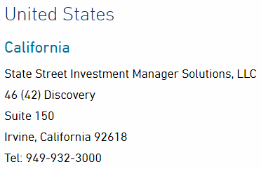<br>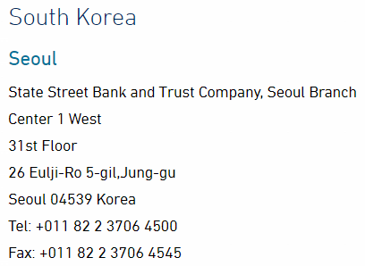
 **4** |    Телефон      | **Tech Phone, Admin Phone, Registrant Phone:** +1.7813025609
 **5** |     E-mail      | **Tech Email, Admin Email, Registrant Email:** whs@statestreet.com
 **6** |     Порты       | 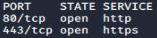
 **7** |     Хостинг     | 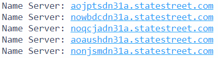<br>На основе DNS-серверов можем сделать вывод, что они хостят сами себя. 
 **8** |  Web-технологии | 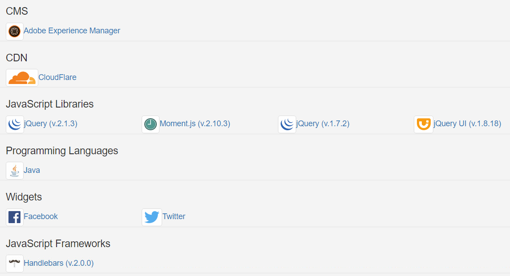

<br><br>
<font size="5">
<center>**PVH Corp.**</center>
</font>
<br>

 **№** |   **Признак**   |     **Значение**
-------|-----------------|-----------------------
 **1** |      Сайт       | [pvh.com](https://www.pvh.com)
 **2** |    IP-адрес     | *63.240.96.226*<br> **United States** 
 **3** | Местонахождение | 200 Madison Avenue,<br> New York,<br> NY 10016
 **4** |    Телефон      | *Phone number:* 1-888-866-6948
 **5** |     E-mail      | *Admin Email:* admin@pvh.com<vr>*Questions and complaints:* hroperationsams@pvh.com
 **6** |     Порты       | 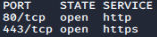
 **7** |     Хостинг     | 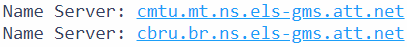<br>На основе DNS-серверов можем сделать вывод, что хостинг-провайдер [AT&T](https://www.att.com)
 **8** |  Web-технологии | 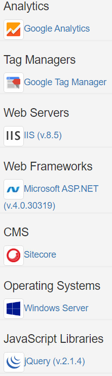
 
<br><br>
<font size="5">
<center>**HP Inc.**</center>
</font>
<br>

 **№** |   **Признак**   |     **Значение**
-------|-----------------|-----------------------
 **1** |      Сайт       | [HP.com](https://www8.hp.com/us/en/home.html)
 **2** |    IP-адрес     | *15.72.164.74*<br> **United States**
 **3** | Местонахождение | Palo Alto,<br> California,<br> United States
 **4** |    Телефон      | *Tech Phone, Admin Phone, Registrant Phone:* +1.8005247638
 **5** |     E-mail      | *Tech Email, Admin Email, Registrant Email:* hp.domains@hp.com
 **6** |     Порты       | 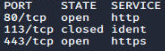
 **7** |     Хостинг     | 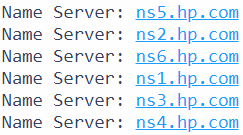<br>На основе DNS-серверов можем сделать вывод, что они хостят сами себя.
 **8** |  Web-технологии | 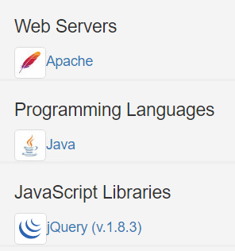

<br><br>
<div style="text-align: left">
<font size="5">
**Вывод:**<br>
Итак, собрали информацию о пяти компаниях. В дальнейшем мы можем использовать ее для различных атак, например DDOS-атаки.
</font>
</div>

```{css echo=FALSE}
table {
  font-size: 20px;
  background: white;
  max-width: 70%;
  border-collapse: collapse;
}
```